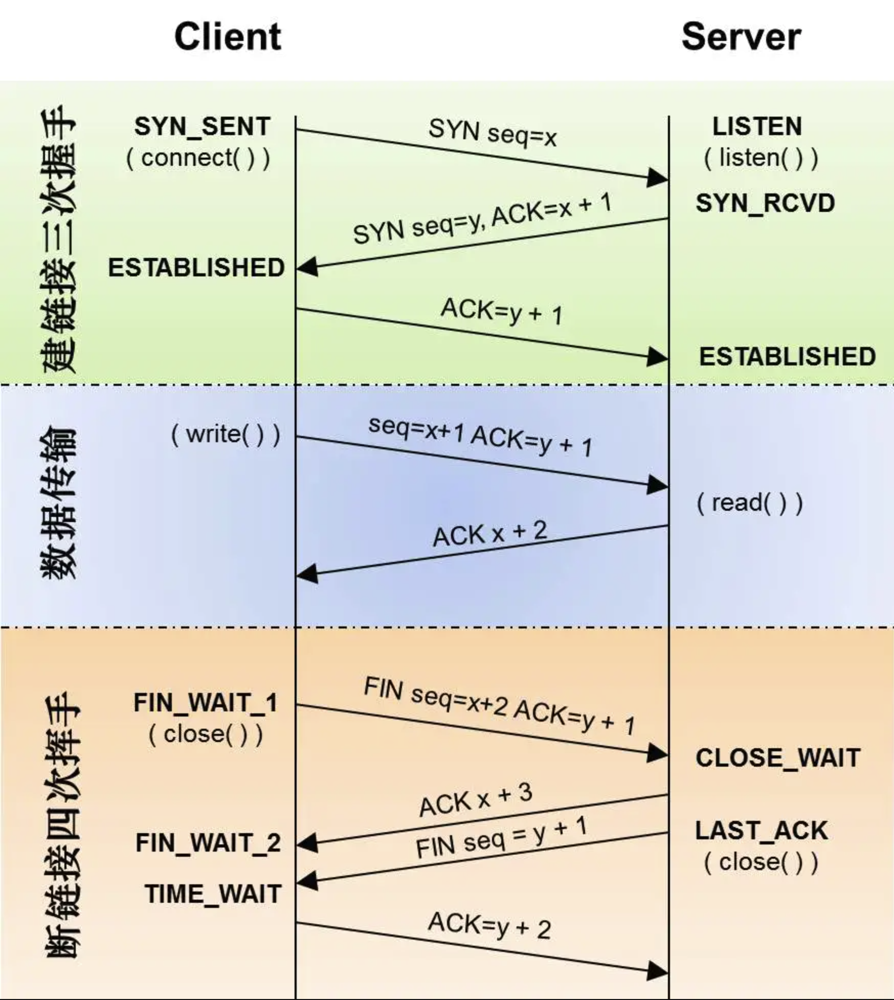
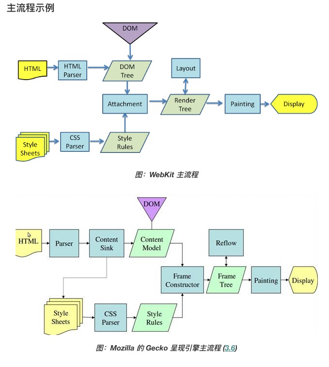

[toc]

### 执行一个URL，浏览器做了什么事情？

1. HTTP请求阶段
   1. DNS解析
   2. TCP连接（三次握手）
   3. 发起HTTP数据请求
2. HTTP响应阶段
   1. 请求行，包含用于请求的方法，URL以及HTTP版本
   2. 状态行，包含表明响应结果的状态码，原因短语和HTTP版本
   3. 首部字段，包含表示请求和响应各种条件和属性的各类首部
   4. 包含HTTP的RFC里未定义的首部cookie等
3. 浏览器渲染阶段
   1. 拿到index.html，浏览器从上到下解析其内容。
   2. 浏览器在内存中开辟一块栈内存，用来给代码提供环境。同时分配一条主线程去执行代码，因此js是单线程执行的。
   3. 当执行过程中遇到外部链接的时候，主线程会引导另外一条线程去向服务器请求外部资源，这样会生成一个任务队列（Task Queue）。
   4. 主线程在执行完成所有代码后会生成一个DOM树，而相关外部资源未必会请求完毕。这样主线程会开始向任务队列中拿取已经完成的资源。向任务队列取资源是一个不断循环的过程，所以叫做事件循环（Event Loop）。
   5. 外部资源css请求回来之后会由主线程生成一个css树，所以会由DOM Tree和CSS Tree生成renderTree。
   6. GPU开始绘制renderTree

---

相关思考：css在任务队列是查看谁先完成就执行谁，那么在HTML中的顺序会影响其最终渲染效果吗？ 

---

### 进程和线程以及栈内存

process： 进程，通俗讲就是在机器上开启的程序

thread：线程，在一个程序中执行的最小单位，一条线程是指进程中一个单一顺序的控制流，每条线程执行其单一的任务

stack：栈内存，在函数中定义的一些基本类型的变量和对象的引用变量

---

### 单核和多核cpu

单核cpu：一次只能执行一个任务，

多核cpu：并行执行多任务 

---

### 三次握手图解

--- 

### 浏览器渲染图解

---

### 任务队列图解

